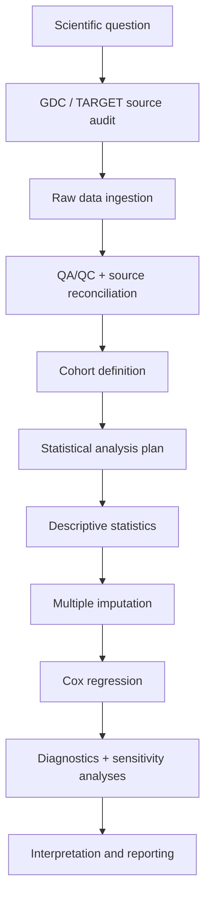
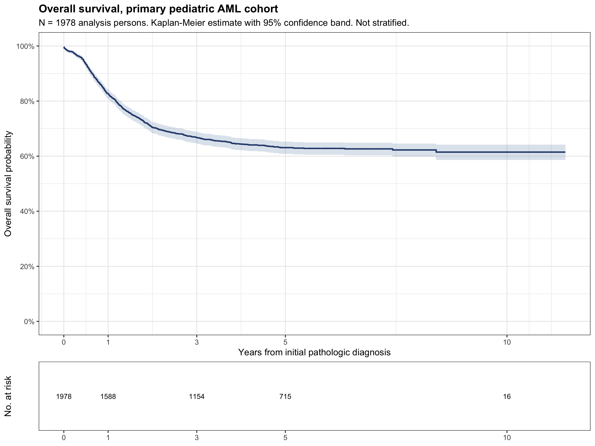
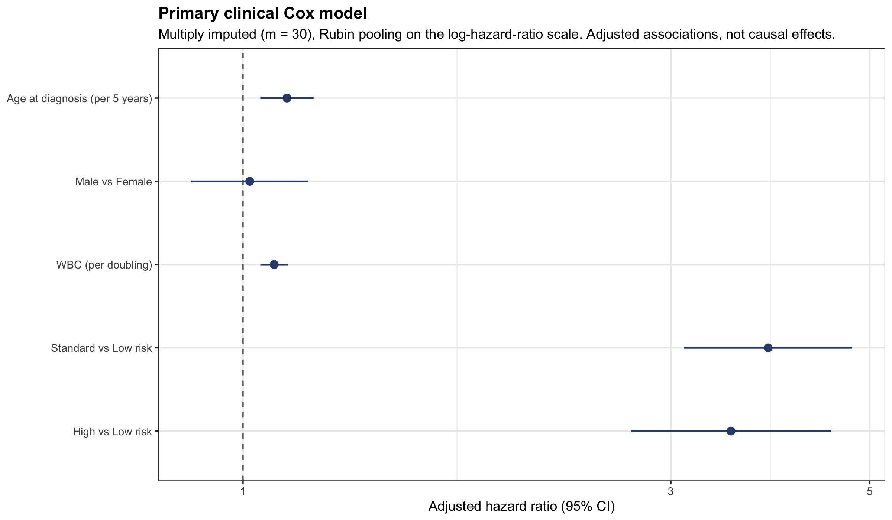
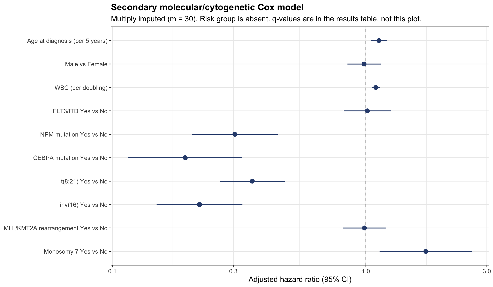
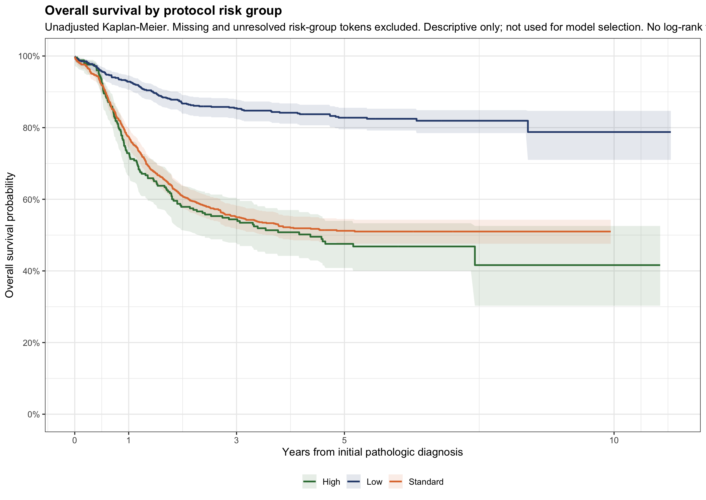

# PediaStat

An end-to-end applied biostatistics study of overall survival in pediatric acute myeloid leukemia using public NCI TARGET-AML clinical data.

PediaStat is a self-directed analysis that follows a scientific question through source validation, data QA/QC, cohort construction, statistical analysis planning, survival analysis, missing-data handling, diagnostics, and interpretation. It is an observational prognostic association study, not a machine-learning platform, clinical decision tool, or validated prediction model.


## Study motivation

Pediatric AML is a useful setting for studying overall survival with heterogeneous baseline clinical and molecular characteristics. Public TARGET-AML data contain those variables, but they are spread across the GDC Cases API and overlapping clinical supplements, with inconsistent identifiers and more than one representation of follow-up time.

The analysis therefore focuses on the full workflow required to move from heterogeneous public clinical sources to a prespecified, reproducible survival analysis: source audit and reconciliation, a frozen cohort and endpoint, a written analysis plan, Kaplan–Meier and Cox models, multiple imputation, and documented diagnostics and limitations.


## Scientific question

> Among children and adolescents with acute myeloid leukemia, which baseline patient and disease characteristics are associated with overall survival?

This is an observational prognostic association analysis. It does **not** estimate causal effects of intervening on a covariate, protocol, or treatment.


## Study workflow




## Data

**Source:** NCI Genomic Data Commons [TARGET-AML](https://gdc.cancer.gov/content/target-aml-publication-summary) (open clinical data only).

| Item | Count |
| --- | ---: |
| Original GDC cases | 2,492 |
| Primary analysis cohort | 1,978 patients diagnosed before age 18 |
| Deaths | 695 |
| Censored | 1,283 |

Normalized GDC clinical data supplied survival and demographic information. Seven open TARGET clinical-supplement workbooks supplied AML-specific baseline characteristics that are sparsely populated in the GDC Cases API. Overlapping sources were reconciled with documented source-precedence rules. GDC was the primary source for the overall-survival endpoint after some supplement OS-time fields were found to be discordant.

Patient-level raw files and analysis extracts are intentionally not committed. This repository does not use controlled-access data.

Details: [source audit](docs/target_aml_source_audit.md), [reconciliation report](docs/target_aml_reconciliation_report.md), [covariate source rules](docs/baseline_covariate_source_rules.md).


## Cohort construction

Ambiguous experimental, cell-line, and non-patient identifiers were excluded rather than guessed. Eighteen persons with multiple compatible GDC cases were deterministically consolidated. Predictor completeness was not used to determine cohort membership. Unknown or missing vital status was not coded as censoring.

```text
2,492 GDC cases
    ↓  exclude 138 experimental / non-patient / ambiguous identifiers
2,354 valid patient-identity cases
    ↓  consolidate biospecimen-level duplicates
2,315 unique valid analysis persons
    ↓
2,152 with a GDC diagnosis
    ↓
2,121 with age at diagnosis
    ↓
1,978 diagnosed before age 18
    ↓
1,978 with a valid overall-survival endpoint
```

Identity rules and endpoint definitions are in [primary cohort specification](docs/primary_cohort_specification.md).


## Statistical approach

Full specification: [inferential model specification](docs/inferential_model_specification.md) and [statistical analysis plan](docs/statistical_analysis_plan.md).

**Overall survival.** Kaplan–Meier estimation from initial pathologic diagnosis.

**Follow-up.** Reverse Kaplan–Meier estimator of potential follow-up.

**Primary clinical model.** Cox proportional hazards regression:

```r
Surv(os_days, os_event) ~ age5 + sex_std + log2_wbc + risk_group_std
```

Age is reported per 5-year increase. WBC is reported per doubling. Sex reference is Female. Risk-group reference is Low.

**Secondary model.** Cox regression with molecular and cytogenetic indicators (FLT3/ITD, NPM, CEBPA, t(8;21), inv(16), MLL/KMT2A, monosomy 7), adjusted for age, sex, and WBC. Protocol risk group is omitted because it already incorporates some of the same biological information.

**Missing data.** Thirty-fold multiple imputation with MICE. The imputation model included the event indicator and a Nelson–Aalen cumulative hazard. The survival outcome itself was not imputed.

**Sensitivity and diagnostics.** Complete-case models; nonlinear age and WBC spline checks; proportional-hazards diagnostics using Schoenfeld residuals; influence diagnostics. No stepwise selection and no interactions.

Ingestion, identifier validation, and cohort construction are implemented in Python with PostgreSQL (`raw` / `staging` / `analytics`). Descriptive and inferential analysis are implemented in R using `survival` and `mice`. Reports are written as Quarto documents.


## Key findings

- Overall 5-year survival was approximately 63% (95% CI 60.8%–65.3%). Median overall survival was not reached. Reverse Kaplan–Meier median potential follow-up was 5.39 years (95% CI 5.29–5.49).
- Both Standard and High protocol risk groups had substantially higher adjusted hazards than Low risk (global risk-group test *p* = 3.7×10⁻³²). The point estimates do not support describing a monotonic Standard < High progression.
- Higher baseline WBC was associated with higher hazard (adjusted HR 1.08 per doubling; 95% CI 1.05–1.12).
- Age showed a modest positive association with hazard (adjusted HR 1.12 per five years; 95% CI 1.05–1.20).
- In the secondary model, NPM, CEBPA, t(8;21), and inv(16) were associated with lower adjusted hazard. Monosomy 7 was associated with higher adjusted hazard. FLT3/ITD was compatible with no association.

These are prognostic associations, not causal effects.

### Primary clinical model

| Predictor | Adjusted HR | 95% CI |
| --- | ---: | ---: |
| Age per 5 years | 1.12 | 1.05–1.20 |
| Male vs Female | 1.02 | 0.88–1.18 |
| WBC per doubling | 1.08 | 1.05–1.12 |
| Standard vs Low risk | 3.85 | 3.10–4.78 |
| High vs Low risk | 3.50 | 2.71–4.53 |

> Hazard ratios represent adjusted prognostic associations and should not be interpreted causally.

Descriptive concordance for the primary model was 0.658. That statistic was not optimized and is not evidence of a validated prediction model.

Secondary-model biological results, complete-case comparisons, and diagnostics are in the [inferential report](reports/stage6_inferential_analysis.qmd).


## Key figures

**Overall survival, primary cohort**



**Primary clinical Cox model**



**Secondary molecular/cytogenetic Cox model**



**Unadjusted survival by protocol risk group (descriptive only)**



Diagnostic plots, spline sensitivities, and additional tables are in `artifacts/inference/` and the inferential report.


## Statistical integrity

- The cohort and overall-survival endpoint were frozen before any predictor–survival analysis.
- Primary and secondary model specifications were frozen before Cox fitting.
- No stepwise selection was performed. No variable was added or removed because of a *p*-value.
- Multiple imputation was the prespecified primary missing-data method; complete-case analysis was a sensitivity analysis.
- The secondary-model FDR family was specified before results were seen.
- Proportional-hazards remediation rules were specified before diagnostics. A minor WBC departure did not trigger remediation.
- The one recorded SAP deviation (collapsed auxiliary race categories in the MICE model) occurred before hazard ratios were viewed and is documented in [stage6_sap_deviations.md](docs/stage6_sap_deviations.md).


## Limitations

- Observational analysis; associations are not causal effects.
- The public TARGET-AML population may not generalize to all pediatric AML populations.
- Baseline clinical information came from multiple overlapping public supplements.
- Some candidate covariates were missing. Multiple imputation uses a Missing At Random working assumption that was not proven.
- Residual confounding is possible, including unmeasured disease biology and care access.
- Molecular and cytogenetic analyses are secondary. Some categories are sparse (for example, 38 monosomy 7 cases).
- No external validation was performed.
- Concordance is descriptive and is not evidence of a validated prediction model.
- The 10-year Kaplan–Meier risk set is small.


## Reproducibility

The committed artifacts and reports are sufficient to read the finished analysis. Re-running the pipeline is optional and requires local Python, PostgreSQL, and the `pediastat-r` conda environment.

```bash
make check        # lint, pytest, and environment check (no database required)
make descriptive  # Table 1, overall KM, reverse KM, descriptive report
make inference    # MICE, Cox models, diagnostics, inferential report
```

`make check` confirms the Python package, tests, and configuration. `make descriptive` reads the locked cohort and writes aggregate descriptive artifacts. `make inference` runs the frozen MICE specification (*m* = 30), pools the primary and secondary Cox models, writes aggregate inferential artifacts, and renders the inferential report.

Stack: Python, PostgreSQL (`raw` / `staging` / `analytics`), R, `survival`, `mice`.

Source data are not in the repository. Downloaded clinical files belong under `data/raw/` and are gitignored. See [analysis/R/README.md](analysis/R/README.md) for the R environment.


## Repository map

| Path | Role |
| --- | --- |
| `src/pediastat/` | Python package for audit, ingestion, validation, and cohort construction |
| `analysis/R/` | R scripts for descriptive analysis, MICE, Cox models, and diagnostics |
| `sql/` | PostgreSQL schema and analytics-layer DDL |
| `docs/` | Analysis plan, cohort rules, source audit, and decision log |
| `reports/` | Quarto reports |
| `artifacts/` | Aggregate tables and figures (no patient-level extracts) |

Specification documents include the [statistical analysis plan](docs/statistical_analysis_plan.md), [inferential model specification](docs/inferential_model_specification.md), and [project decisions](docs/project_decisions.md).
