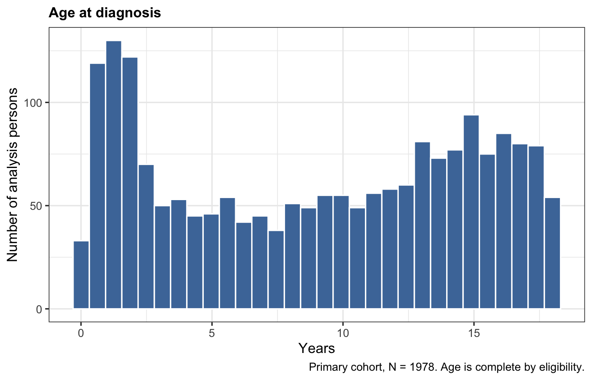
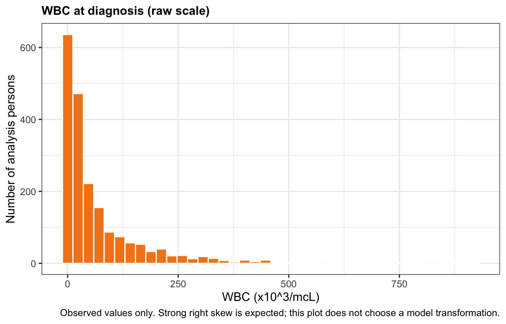
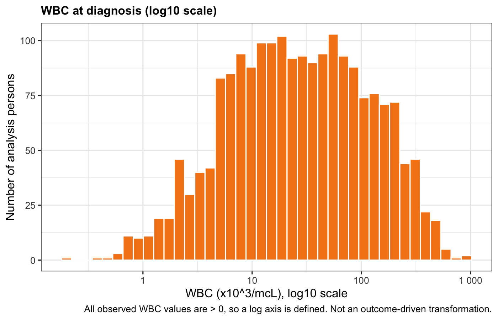
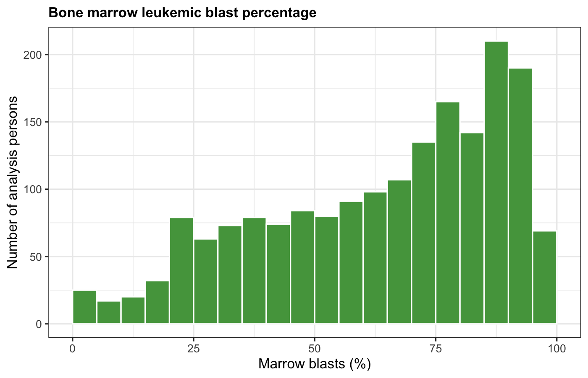
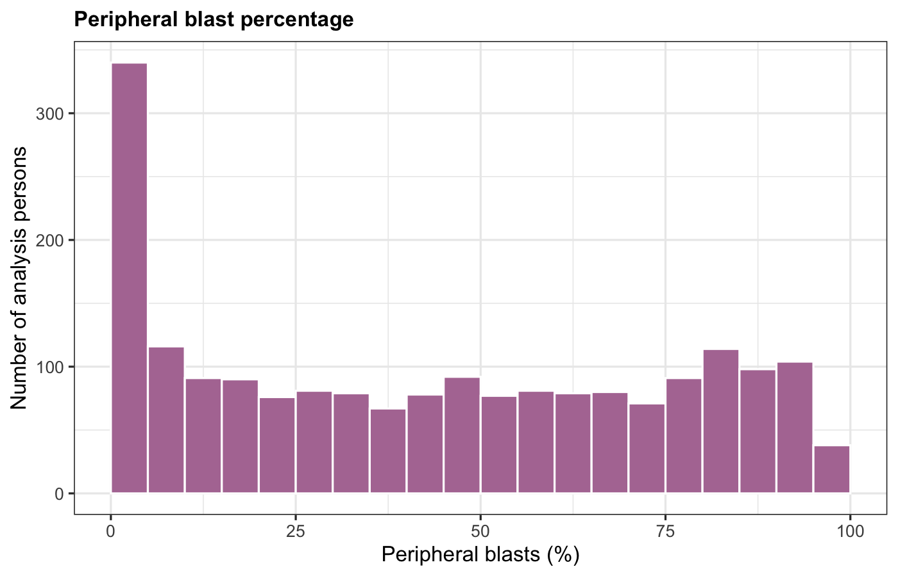
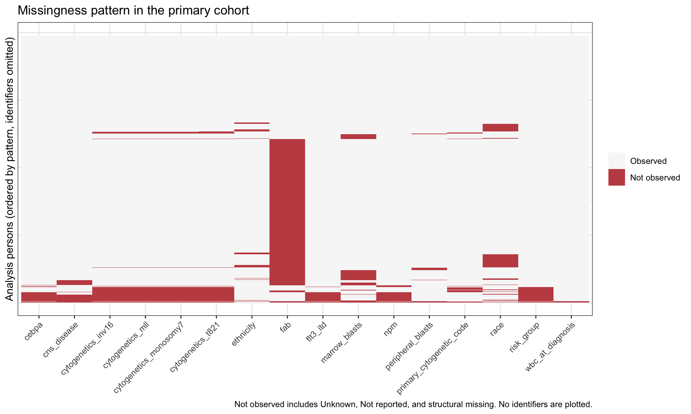

```{r}
#| label: setup
library(jsonlite)
library(gt)

root <- here::here()
desc <- file.path(root, "artifacts", "descriptive")
fig <- file.path(desc, "figures")

read_desc <- function(name) {
  utils::read.csv(file.path(desc, name), check.names = FALSE, stringsAsFactors = FALSE)
}

accounting <- fromJSON(file.path(desc, "population_accounting.json"))
endpoint <- fromJSON(file.path(desc, "endpoint_followup_description.json"))
followup <- fromJSON(file.path(desc, "followup_summary.json"))
km_summary <- fromJSON(file.path(desc, "overall_survival_summary.json"))
session <- fromJSON(file.path(desc, "r_session_info.json"))
km_est <- read_desc("overall_survival_estimates.csv")
n_risk <- read_desc("number_at_risk.csv")
cont <- read_desc("continuous_distribution_summary.csv")
miss <- read_desc("missingness_by_variable.csv")
prov <- read_desc("baseline_source_provenance.csv")
readiness <- read_desc("core_candidate_readiness.csv")
redundancy <- read_desc("redundancy_findings.csv")
patterns <- read_desc("missingness_patterns_top15.csv")
```

# 1. Scientific Objective

This report describes the prespecified primary pediatric acute myeloid leukemia (AML) cohort in public TARGET-AML data and estimates the **overall** survival distribution.

The scientific question remains observational: which baseline patient and disease characteristics are associated with overall survival? That inferential question is **not** answered here. Stage 4 does not compare survival across baseline subgroups, does not fit Cox models, and does not use p-values to screen covariates.

The aims of this stage are to:

- confirm the frozen Stage 3 population accounting
- describe baseline characteristics of the locked cohort
- quantify missingness and source provenance
- estimate overall Kaplan–Meier survival and reverse Kaplan–Meier follow-up
- record analysis-readiness issues that Stage 5 must resolve before modeling

# 2. Prespecified Study Population

The unit of analysis is the **analysis person**, identified by a canonical TARGET USI (`TARGET-20-XXXXXX` or `TARGET-21-XXXXXX`), not a raw GDC case.

A person is in the primary overall-survival (OS) cohort if all of the following locked Stage 3 rules hold:

1. Unambiguous analysis-person identity
2. GDC diagnosis entity present
3. GDC age at diagnosis available
4. Age at diagnosis **< 18 years** (days / 365.25)
5. GDC vital status Alive or Dead
6. Valid status-specific OS time

Unknown, Not Reported, and missing vital status are excluded. They are never coded as censored.

Candidate covariates (WBC, risk group, FLT3/ITD, NPM, CEBPA, FAB, race, ethnicity) are **not** inclusion criteria.

# 3. Cohort Construction Summary

Stage 3 is frozen. Descriptive findings in this report do not change eligibility.

```{r}
#| label: attrition-accounting
data.frame(
  Quantity = c(
    "Original GDC cases",
    "GDC cases mapping to valid person identity",
    "Unique valid analysis persons",
    "GDC cases ineligible (experimental / non-patient / ambiguous)",
    "Rows in analytics.cohort_eligibility",
    "Valid persons in eligibility table",
    "Ineligible identity records retained for audit",
    "Primary OS cohort"
  ),
  N = c(
    accounting$original_gdc_cases,
    accounting$gdc_cases_valid_identity,
    accounting$unique_valid_analysis_persons,
    accounting$gdc_cases_ineligible_identity,
    accounting$cohort_eligibility_rows,
    accounting$cohort_eligibility_valid_persons,
    accounting$cohort_eligibility_ineligible_identity_records,
    accounting$primary_os_cohort_n
  )
) |>
  gt() |>
  tab_header(title = "Identity and eligibility accounting") |>
  tab_source_note(accounting$interpretation)
```

Primary OS event: GDC `demographic.vital_status` (Dead = 1, Alive = 0).  
Primary OS time: `days_to_death` if Dead; `diagnoses.days_to_last_follow_up` if Alive.  
Time origin: initial pathologic diagnosis / GDC index date.

# 4. Primary Cohort Characteristics

Table 1 is an **overall** description of the locked cohort. It is not stratified by death status or any survival outcome, and it contains no p-values.

Unknown remains a displayed category. Structural missingness is labeled Missing. Percentages use the full cohort denominator (N = `r endpoint$primary_cohort_n`).

FLT3/ITD, NPM, CEBPA, and cytogenetic lesion flags are shown with case-harmonized Yes/No. The source files mix `Yes`/`YES` and `No`/`NO`; that is a coding QA issue, not a clinical collapsing decision.

```{r}
#| label: table1
tbl1 <- read_desc("table1_primary_cohort.csv")
gt(tbl1) |>
  tab_header(
    title = "Table 1. Baseline characteristics of the primary pediatric AML cohort",
    subtitle = "Prespecified overall cohort. Not stratified by survival. No p-values."
  ) |>
  tab_source_note("Median (Q1, Q3) for continuous variables; n (%) for categorical variables. Denominator is N = 1978 unless a row is a nested level.")
```

Exportable copies: `artifacts/descriptive/table1_primary_cohort.html` and `.csv`.

# 5. Baseline Variable Distributions

Continuous summaries use observed values only. Zeros are retained as observed. No outcome-driven transformation was selected.

```{r}
#| label: continuous-table
cont_show <- cont[cont$variable %in% c(
  "age_at_diagnosis_years", "wbc_at_diagnosis", "marrow_blasts", "peripheral_blasts"
), c("variable", "units", "n_observed", "n_missing", "mean", "sd", "median", "q1", "q3", "min", "max", "n_zero", "n_negative", "skewness")]
gt(cont_show) |>
  fmt_number(columns = c(mean, sd, median, q1, q3, min, max, skewness), decimals = 2) |>
  tab_header(title = "Continuous baseline distributions") |>
  tab_source_note("WBC units are CDE x10^3/mcL. Blast percentages are source percent scales. Age years = days / 365.25.")
```







All observed WBC values are greater than 0, so a log10 axis is defined. The log plot is descriptive. It does not lock a future model transformation.





Categorical levels, including sparse and unexpected tokens, are in `artifacts/descriptive/categorical_level_audit.csv`. Levels were not collapsed. Risk-group tokens `10` and `30` are retained and flagged for clinical review.

# 6. Missing Data

Missingness is described for analysis planning. These summaries do not establish MCAR, MAR, or MNAR, and they are not tested against survival.

```{r}
#| label: missingness-table
gt(miss[, c("concept", "observed_n", "missing_n", "missing_percent", "unknown_n", "not_reported_n", "structurally_missing_n", "conflict_n")]) |>
  fmt_number(columns = missing_percent, decimals = 2) |>
  tab_header(title = "Missingness by baseline concept in the primary cohort") |>
  tab_source_note("Missing_n = N minus observed. Unknown is a reported source class, not automatically merged with structural missing.")
```

```{r}
#| label: missing-patterns
gt(patterns) |>
  tab_header(title = "Most common missingness patterns") |>
  tab_source_note("A complete row on tabulated covariates is the pattern with zero variables missing. Identifiers are not shown.")
```



No multiple imputation was performed.

# 7. Data Source / Provenance Summary

AML-specific covariates are taken from overlapping open clinical supplements using the frozen Stage 3 precedence rules. Conflicts keep the precedence winner and a flag; values are not averaged.

```{r}
#| label: provenance
gt(prov) |>
  tab_header(title = "Source contributing the selected baseline value") |>
  tab_source_note("Counts are among the primary cohort (N = 1978). GDC is expected for age, sex, race, and ethnicity.")
```

# 8. Overall Survival

Overall survival is estimated by Kaplan–Meier for the entire primary cohort. The curve is not stratified by any predictor. No log-rank test and no Cox model were fit.

```{r}
#| label: km-estimates
km_show <- km_est[km_est$time_years %in% c(1, 3, 5), ]
gt(km_show) |>
  fmt_number(columns = c(survival, surv_lcl, surv_ucl), decimals = 3) |>
  cols_label(
    time_years = "Year",
    n_risk = "No. at risk",
    n_event = "Events in interval",
    survival = "OS probability",
    surv_lcl = "95% CI lower",
    surv_ucl = "95% CI upper"
  ) |>
  tab_header(title = "Kaplan–Meier overall survival at 1, 3, and 5 years")
```

**Median OS:** `r km_summary$median_os$statement`


```{r}
#| label: n-risk
gt(n_risk) |>
  fmt_number(columns = survival, decimals = 3) |>
  tab_header(title = "Number at risk") |>
  tab_source_note("Time is years from initial pathologic diagnosis. At 10 years only 16 persons remain at risk; that estimate is unstable and is shown only to document the limit of follow-up.")
```

# 9. Follow-Up Duration

Follow-up is **not** summarized as the median of `os_days`.

Potential follow-up is estimated by the **reverse Kaplan–Meier** method: deaths are treated as censored, and persons originally censored for OS are treated as events. This estimates the follow-up distribution, not overall survival.

`r followup$statement`

`r followup$interpretation`

The median of observed OS times (`r followup$observed_os_days_median` days) is a range descriptor only. It must not be labeled median follow-up or Kaplan–Meier median survival.

Observed OS range: `r endpoint$observed_os_days_min`–`r endpoint$observed_os_days_max` days (`r round(endpoint$observed_os_years_min, 2)`–`r round(endpoint$observed_os_years_max, 2)` years).

# 10. Analysis-Readiness Assessment

CORE CANDIDATE review uses definition, coding, missingness, sparsity, and source quality. Survival association was not used.

```{r}
#| label: readiness
gt(readiness) |>
  tab_header(title = "CORE CANDIDATE analysis-readiness")
```

Predictor-to-predictor redundancy was examined without `os_event` or `os_days`:

```{r}
#| label: redundancy
gt(redundancy) |>
  tab_header(title = "Potential redundancy to review before model specification")
```

These findings are not automatic exclusions.

# 11. Limitations

- Public TARGET-AML data are observational and incomplete relative to controlled-access clinical files.
- Baseline AML characteristics come from overlapping supplements with a frozen precedence rule; residual source conflict remains flagged rather than overwritten.
- Missing baseline values are common for FAB and non-negligible for several molecular and cytogenetic fields.
- Seven primary-cohort persons have an `index_date` QA flag; they were retained under the locked Stage 3 rule.
- Crude death percentage (`r endpoint$crude_event_percent`%) is not a cumulative mortality risk because follow-up differs across persons.
- No causal interpretation is offered.
- No multivariable inference, missing-data method, or sensitivity survival analysis has been performed.

# 12. Next Statistical Decisions

Stage 5 must freeze the inferential plan **before** regression is run, including:

1. Which CORE and SECONDARY covariates enter the primary Cox model
2. Functional form for age and WBC (linear, log, spline), prespecified rather than chosen by survival association
3. Handling of Unknown versus structural missingness
4. The missing-data method (complete case is not the default decision)
5. Whether risk group and lesion flags / FLT3 can co-exist given redundancy
6. Coding of unexpected risk-group tokens (`10`, `30`) and mixed-case Yes/No
7. Whether primary cytogenetic code is used at all (currently NEEDS REVIEW)
8. Interaction terms, if any
9. Multiplicity rules for secondary/exploratory analyses
10. Proportional-hazards assessment and remediation strategy
11. Whether predictor-stratified Kaplan–Meier curves will be shown, and if so under what multiplicity plan

# Appendix

R `r session$r_version` (`r session$running`). Analysis scripts live under `analysis/R/` and read `analytics.stage4_primary_cohort_extract`. Person-level extracts are gitignored.
